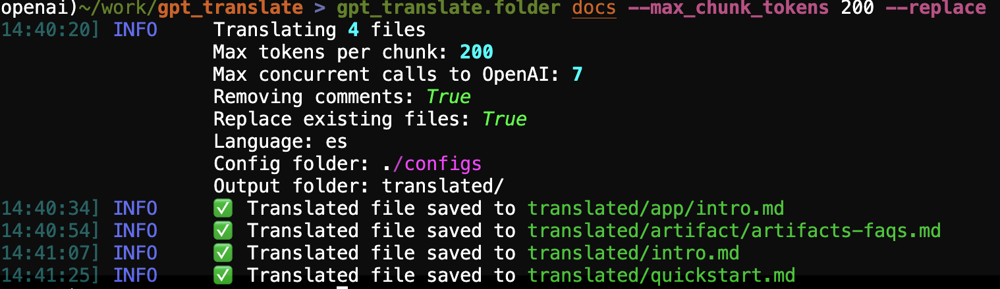

[](https://badge.fury.io/py/gpt_translate)

# gpt_translate: Translating MD files with GPT-4
This is a tool to translate the language in Markdown files.




> You will need and OpenAI API key to use this tool.

## Installation
We have a stable version on PyPi, so you can install it with pip:
```bash
$ pip install gpt-translate
```
or to get latest version from the repo:

```bash
$ cd gpt_translate
$ pip install .
```

Export your OpenAI API key:

```bash
export OPENAI_API_KEY=aa-proj-bbbbbbbbbbbbbbbbbbbbbbbbbbbbbbbbbbbbbbbbbbbbbbbb
```

## Usage

The library provides a set of commands that you can access as CLI. All the commands start by `gpt_translate.`:

- `gpt_translate.file`: Translate a single file
- `gpt_translate.folder`: Translate a folder recursively
- `gpt_translate.files`: Translate a list of files, accepts `.txt` list of files as input.


We use GPT4 by default. You can change this on `configs/config.yaml`. The dafault values are:

```yaml
# Logs:
debug: false  # Debug mode
weave_project: "gpt-translate"  # Weave project
silence_openai: true  # Silence OpenAI logger

# Translation:
language: "ja"  # Language to translate to
config_folder: "./configs"  # Config folder, where the prompts and dictionaries are
replace: true  # Replace existing file
remove_comments: true  # Remove comments
do_evaluation: true  # Do evaluation
do_translate_header_description: true  # Translate the header description
max_openai_concurrent_calls: 7  # Max number of concurrent calls to OpenAI

# Files:
input_file: "docs/intro.md"  # File to translate
out_file: " intro_ja.md"  # File to save the translated file to
input_folder: null  # Folder to translate
out_folder: null  # Folder to save the translated files to
limit: null  # Limit number of files to translate

# Model:
model: "gpt-4o"
temperature: 1.0
max_tokens: 4096

```
You can override the arguments at runtime or by creating another `config.yaml` file. You can also use the `--config_path` flag to specify a different config file.

- The `--config_folder` argument is where the prompts and dictionaries are located, the actual `config.yaml` could be located somewhere else. Maybe I need a better naming here =P.

- You can add new languages by providing the language translation dictionaries in `configs/language_dicts`

## Examples

1. To translate a single file:

```bash
$ gpt_translate.file \
  --input_file README.md \
  --out_file README_es_.md \
  --language es
```

2. Translate a list of files from `list.txt`:

```bash
$ gpt_translate.files \
  --input_file list.txt \
  --input_folder docs \ 
  --out_folder docs_ja \
  --language ja
```

Note here that we need to pass and input and output folder. This is because we will be using the input folder to get the relative path and create the same folder structure in the output folder. This is tipically what you want for documentation websites that are organized in folders like `./docs`.

3. Translate a full folder recursively:

```bash
$ gpt_translate.folder \
  --input_folder docs \
  --out_folder docs_ja \
  --language ja
$ gpt_translate.file --help
```

If you don't know what to do, you can always do `--help` on any of the commands:

```bash
$ gpt_translate.* --help
```

## Validation

The library performs an evaluation of the quality of the translation if `--do_evaluation` is set to `true`.
You can modify the output of the LLM evaluation by changing the `configs/evaluation_prompt.txt`.

Play with this prompt and maybe you can find better ways to evaluate the quality of the translation.

## Weave Tracing

The library does a lot! keepins track of every piece of interaction is necessary. We added [W&B Weave](wandb.me/weave) support to trace every call to the model and underlying processing bits.

You can pass a project name to the CLI to trace the calls:

```bash
$ gpt_translate.folder \
  --input_folder docs \
  --output_folder docs_ja \
  --language ja \
  --weave_project gpt-translate
```


## TroubleShooting

If you have any issue, you can always pass the `--debug` flag to get more information about what is happening:

```bash
$ gpt_translate.folder ... --debug
```
this will get you a very verbose output (calls to models, inputs and outputs, etc.)
